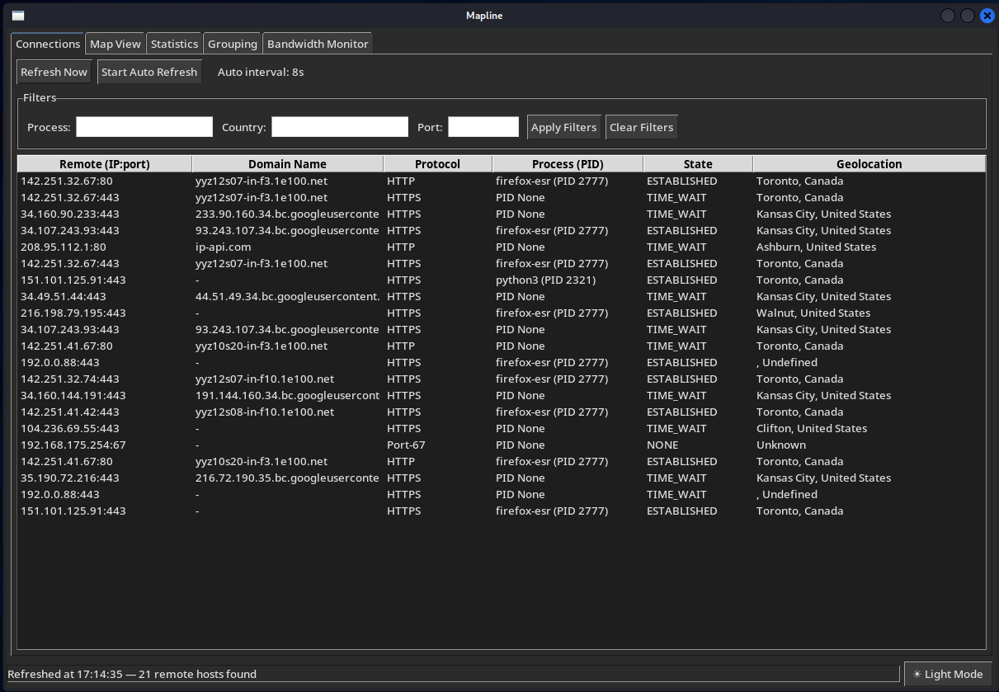
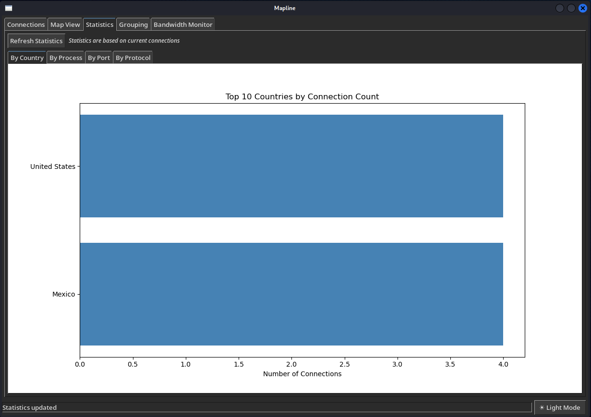

# Mapline

A powerful graphical tool that maps and visualizes all outbound network connections from your computer on an interactive world map. See exactly where your data is going, which processes are making connections, and monitor your network activity in real-time.

# Features

### Connection Monitoring
- **Real-time connection tracking** - See all active outbound connections
- **Process identification** - Know which applications are making connections
- **Protocol detection** - Automatic protocol recognition by port
- **Smart filtering** - Filter by process, country, or port
- **Connection details** - Double-click any connection for full details

### Geographic Visualization
- **Interactive world map** - See your connections visualized globally
- **Connection paths** - Visual lines showing data routes
- **Geolocation data** - City, country, ISP, and organization information
- **Your location** - Automatically detects and marks your public IP location

## 📊 Advanced Analytics

### Statistical Charts
- **Connections by Country** - See which countries you're connecting to most frequently
- **Connections by Process** - Identify which applications are most network-active
- **Connections by Port** - View port usage distribution across your connections
- **Connections by Protocol** - Understand protocol distribution in your network traffic

### Grouping Views
- **Organize by Domain** - Group connections by their domain names for easy analysis
- **Organize by Organization** - View connections grouped by ISP and company affiliations
- **Organize by Subnet** - See connections organized by IP address ranges (/24 subnets)

### Bandwidth Monitoring
- **Real-time Traffic Tracking** - Monitor live network activity as it happens
- **Transfer Rate Display** - See current data rates for each active connection
- **Connection Duration** - Track how long each connection has been active
- **Total Data Estimation** - Monitor cumulative data transfer per connection

### User Experience
- **Dark/Light themes** - Choose your preferred interface style
- **Tabbed interface** - Easy navigation between different views
- **Auto-refresh** - Continuous monitoring with configurable intervals
- **Responsive design** - Works great on different screen sizes

## 🚀 Quick Start

### Prerequisites
- Python 3.10 or higher
- Internet connection (for maps and geolocation)

### Installation
1. **Clone the repository**
```bash
git clone https://github.com/iqlipx/mapline.git
```
- **cd mapline**

2. **Install dependencies**
```bash
pip install psutil requests tkintermapview matplotlib
```
- **Linux users may need:**
```bash
sudo apt update
sudo apt install python3-tk
```
3. **Run the application**
```bash
python Mapline.py
```

## 📖 How to Use

### First Launch
1. Open the application
2. Click "Refresh Now" in the Connections tab
3. Watch as your network connections populate the list
4. Explore different tabs to see various visualizations

### Understanding the Interface
| Tab | Purpose |
|-----|---------|
| **Connections** | List all active outbound connections with filters |
| **Map View** | Geographic visualization of connection paths |
| **Statistics** | Charts and analytics about your connections |
| **Grouping** | Connections organized by categories |
| **Bandwidth** | Real-time traffic monitoring |

### Screenshots

*Main connections list with filtering options*


*Interactive world map showing connection paths*


*Analytics charts by country, process, port, and protocol*


*Real-time bandwidth and traffic monitoring*

### Key Actions
- Double-click any connection for detailed information
- Use filters to focus on specific processes or countries
- Toggle auto-refresh for continuous monitoring
- Switch themes between dark and light mode
- Start bandwidth monitoring to track data usage

## 🛠️ Configuration
Edit these settings in the script for customization:

```python
REFRESH_INTERVAL = 8.0          # Auto-refresh interval (seconds)
MAX_GEO_WORKERS = 10            # Parallel geolocation requests
MAX_DNS_WORKERS = 10            # Parallel DNS resolution threads
BANDWIDTH_UPDATE_INTERVAL = 2.0 # Bandwidth update frequency
```

## 🎯 Use Cases

### 🔒 Security & Monitoring
- **Threat Detection** - Identify suspicious outbound connections and potential malware
- **Network Auditing** - Monitor all external connections for security compliance
- **Data Exfiltration Prevention** - Detect unauthorized data transfers
- **Incident Response** - Investigate security incidents and breach attempts
- **Compliance Monitoring** - Ensure data sovereignty and regulatory requirements
- **Unknown Process Detection** - Identify unfamiliar processes making network calls
- **Geographic Threat Analysis** - Flag connections to high-risk countries

## 🌍 How It Works

### 1. Connection Discovery
- Uses `psutil.net_connections()` to scan all active TCP/UDP connections
- Filters for outbound connections only (remote addresses)
- Excludes localhost and internal network connections
- Captures process ID (PID) and process name for each connection

### 2. Data Enrichment
- **Geolocation**: Queries ip-api.com to get country, city, coordinates, and ISP
- **DNS Resolution**: Performs reverse DNS lookups to find domain names
- **Protocol Detection**: Maps port numbers to service names (HTTP, SSH, etc.)
- **Caching**: Stores geolocation and DNS results to avoid repeated API calls

### 3. Parallel Processing
- Uses `ThreadPoolExecutor` for concurrent geolocation requests
- Processes multiple IP addresses simultaneously (up to 10 threads)
- Implements DNS resolution in parallel for faster results

### 4. Visualization
- **Map View**: Uses tkintermapview to display connections on OpenStreetMap
- **Charts**: Uses matplotlib for statistical charts and graphs
- **Real-time Updates**: Continuously refreshes data at configurable intervals

### 5. Bandwidth Monitoring
- Tracks connection duration and estimated data transfer
- Calculates transfer rates using system-wide network statistics
- Updates bandwidth display every 2 seconds during active monitoring


## 🐛 Known Issues & Fixes

### Current Limitations
- Bandwidth monitoring provides estimates rather than precise measurements
- Some connections may show "Unknown" for geolocation data
- Map may load slowly with poor internet connections
- Process names may not resolve for all connections

### Planned Features
- **Export functionality** - Save connection data to CSV/JSON
- **Historical logging** - Track connections over time
- **Custom alerts** - Notifications for specific connection patterns
- **More geolocation providers** - Fallback options for better coverage
- **Enhanced filtering** - More advanced search and filter options
- **Network capture** - Integrate with packet capture for detailed analysis

### Recent Fixes
- Improved error handling for geolocation API failures
- Better memory management for long-running sessions
- Fixed duplicate connection entries in lists
- Enhanced DNS resolution with timeout handling
- Improved map marker clustering for dense regions

## 🤝 Contributing

### Areas for Contribution

#### 🚀 Feature Development
- **Export functionality** - Save connection data to CSV/JSON
- **Historical logging** - Track connections over time
- **Custom alerts** - Notifications for specific connection patterns
- **More geolocation providers** - Fallback options for better coverage
- **Enhanced filtering** - More advanced search and filter options
- **Network capture** - Integrate with packet capture for detailed analysis
- **Dashboard improvements** - Additional visualization options

#### 🐛 Bug Fixes & Improvements
- **Bandwidth accuracy** - Improve precision of traffic monitoring
- **Performance optimization** - Faster connection scanning and rendering
- **Error handling** - Better recovery from API failures
- **Memory management** - Reduce resource usage for long sessions
- **Cross-platform compatibility** - Fix platform-specific issues
- **UI/UX improvements** - Enhanced user interface and experience

## 🙏 Acknowledgments

- **ip-api.com** - For providing free IP geolocation services
- **OpenStreetMap** - For the open map data and tiles used in the visualization
- **psutil** - For cross-platform system and process utilities

## ❓ FAQ

### 🔧 Common Questions
**Q: Why are some connections missing geolocation data?**
- Some IP addresses cannot be geolocated
- The geolocation service may be temporarily unavailable
- Corporate or cloud IPs often have limited location data

**Q: How accurate is the bandwidth monitoring?**
- Provides estimates based on system-wide network statistics
- Best for identifying high-usage connections rather than precise measurements
- Updates every 2 seconds when monitoring is active

**Q: Can I use Mapline on a server without GUI?**
- Requires graphical interface for the map and charts
- Consider using command-line alternatives for headless servers

**Q: Is my data private?**
- Only IP addresses are sent to ip-api.com for geolocation
- No personal data or connection content is transmitted
- All processing happens locally on your machine

**Q: Why can't I see any connections?**
- Ensure you have active outbound internet connections
- Some systems may require administrator privileges
- Check if your firewall is blocking the application

**Q: The map isn't loading, what should I do?**
- Verify your internet connection is working
- Check if your firewall allows map tile downloads
- Try refreshing the map or restarting the application

**Q: How often should I refresh the connections?**
- For general monitoring: 8-second intervals are sufficient
- For detailed analysis: Use manual refresh as needed
- For bandwidth monitoring: 2-second intervals provide good detail

**Q: Can I export the connection data?**
- Currently available in the application interface only
- Export functionality is planned for future versions
- You can take screenshots of the data displays

**Q: Does Mapline work on all operating systems?**
- Works on Windows, macOS, and Linux with GUI
- Requires Python 3.8+ and internet connection
- Linux users may need to install python3-tk separately

---

<div align="center">

**See your digital footprint. Understand your network. Take control.**

*Made with ❤️ for the security community*

⭐ **If you find this tool useful, please give it a star!** ⭐

</div>
